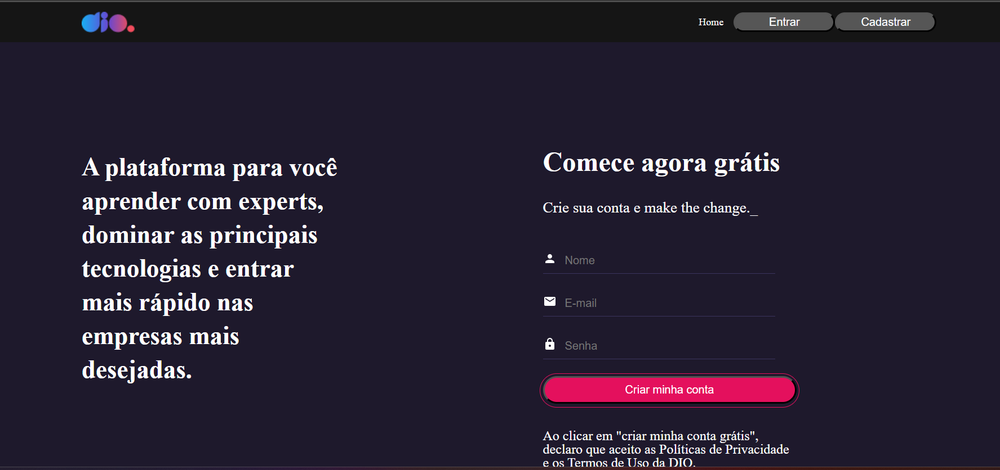
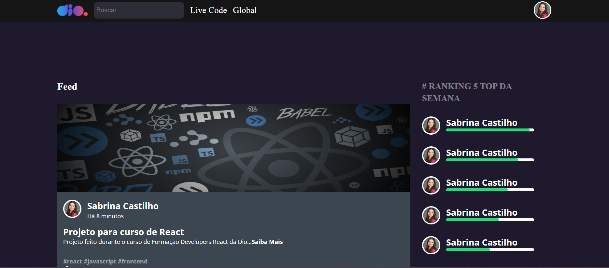

# 💻 DIO Login Project - Clone
> **Status do Projeto:** Concluído ✅
>


[](https://www.linkedin.com/in/sabrina-castilho/)

## 📖 Sobre o Projeto
Projeto desenvolvido como parte do curso **Formação Developers React da DIO**. O objetivo principal é a replicação da interface e das funcionalidades de fluxo de usuário da plataforma, focando em boas práticas de componentização e gerenciamento de rotas.

## 🚀 Telas Implementadas
O projeto reproduz a experiência completa de navegação em 4 páginas principais:

- ### **Home:** *Página institucional com a proposta da plataforma.*
---


- ### **Login:** Validação de credenciais consumindo dados de uma API simulada.
---

   
- ### **Cadastro:** Registro de novos usuários, incluindo aceite de termos e políticas de privacidade.
---   


- ### **Feed:** Interface logada com listagem de projetos e ranking de usuários.
---   



## 🛠️ Tecnologias e Bibliotecas
Para este projeto, foram utilizadas ferramentas modernas do ecossistema JavaScript:

* **React.js**: Biblioteca base para a construção da interface declarativa.
* **Styled Components**: Utilizado para estilização CSS-in-JS, garantindo escopo e reutilização de estilos.
* **React Router Dom**: Gerenciamento das rotas para navegação entre as 4 páginas sem recarregamento.
* **React Hook Form & Yup**: Manipulação eficiente de formulários e validação de dados de entrada.
* **Axios**: Cliente HTTP para comunicação com o backend.
* **JSON Server**: Ferramenta para simular uma API REST e testar o fluxo de autenticação.

## 📦 Como rodar este projeto

1. **Clone este repositório:**
   ```bash
   git clone [https://github.com/Sabrinafogliene/React.git](https://github.com/Sabrinafogliene/React.git)
   ```
2. **Entre na pasta do repositório:**
   ```bash
   cd React
   ```
3. **Entre na pasta específica desse projeto:**
   ```bash
   cd LoginDio/login-dio
   ```
4. **Instale as dependências:**
   ```bash
   npm install
   ```
5. **Inicie o servidor de desenvolvimento:**
   ```bash
   npm start
   ```

## 🧠 Aprendizados Técnicos
O desenvolvimento deste clone permitiu consolidar conceitos fundamentais para uma **Desenvolvedora de Sistemas Jr**:
- **GlobalStyles:** Criação de um tema global para manter a consistência visual da marca.
- **Flexbox & Layout:** Ajustes finos de alinhamento e quebras de linha em componentes complexos.
- **Integração de API:** Tratamento de requisições **`GET`** com parâmetros de filtro para login.
- **Debbugging:** Resolução de erros de estado e autenticação em tempo real.

## 👩‍💻 Desenvolvedora
**Sabrina F. Castilho** - *Desenvolvedora Jr. | Estudante de Análise e Desenvolvimento de Sistemas*

   
